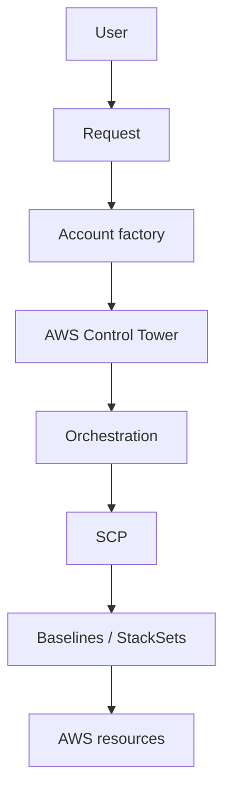
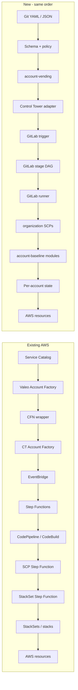
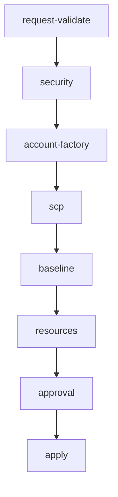
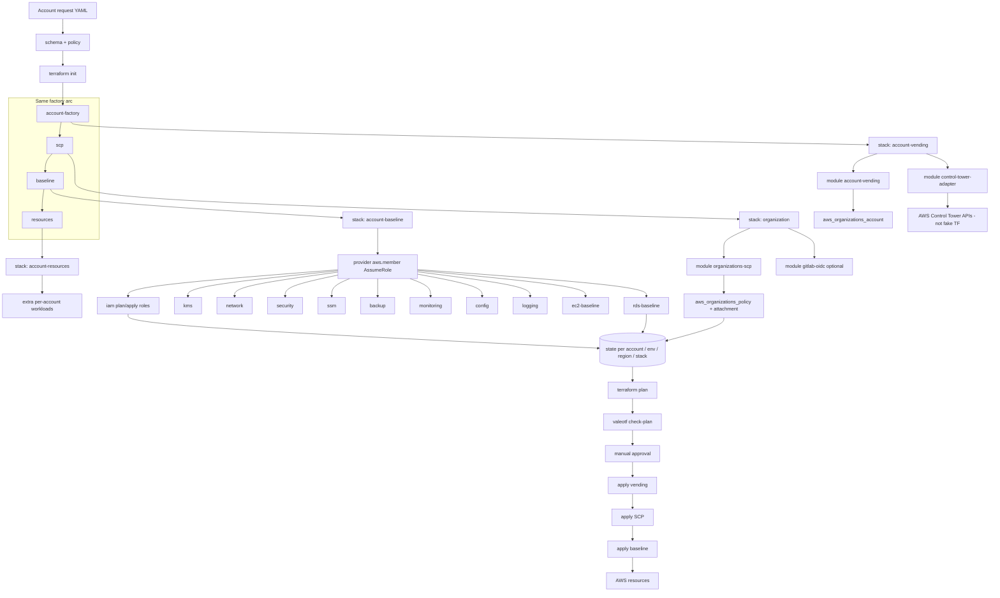
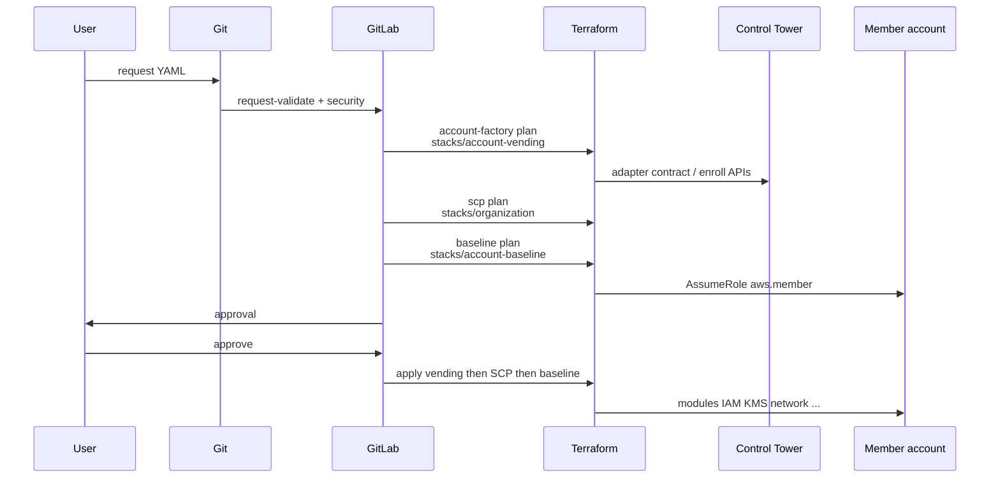

# Account provisioning

New accounts and existing-account adoption share one cloud-neutral request schema: `schemas/account-request.schema.yaml`.

## Architecture (same flow as AWS factory)

One ordered arc. AWS today uses Service Catalog + Step Functions + StackSets. This repo uses Git + GitLab + Terraform. **Control Tower stays AWS.**







## Terraform flow mapped to the arc

GitLab stages stay the factory order. Each Terraform stack is the engine for one arc step. Apply order is the same: vending → SCP → baseline.





| Order | Existing AWS | This repo |
| --- | --- | --- |
| 1 | User | User |
| 2 | Service Catalog | Git YAML + schema/policy |
| 3 | Valeo Account Factory + CFN wrapper | `terraform/stacks/account-vending` |
| 4 | Control Tower Account Factory | AWS Control Tower + adapter |
| 5 | EventBridge | GitLab pipeline trigger |
| 6 | Step Functions | GitLab DAG + Terraform graph |
| 7 | CodePipeline / CodeBuild | GitLab CI / runner |
| 8 | SCP Step Function | `terraform/stacks/organization` |
| 9 | StackSet Step Function + StackSets | `terraform/stacks/account-baseline` |
| 10 | Stacks | Per-account state + modules |

Do not use AWS-specific request fields such as `AWSAccountName`. Use `account.name`, `cloud.provider`, `cloud.region`, `account.requested_ou`.

## New account

```text
User → YAML/JSON → Git → schema + policy → terraform plan → approval
  → terraform apply → Control Tower → member account
  → cross-account role → modules → AWS resources
```

Control Tower enrollment that has no Terraform resource is requested through the adapter (`enroll_if_unenrolled`). The adapter does not fake enrollment.

## Adopt existing

Set:

```yaml
account:
  existing_account_id: "123456789012"
migration:
  mode: adopt-existing
  batch_id: batch-001
  dry_run: true
```

This does not recreate the account. It generates variables and import candidates only.

## Pipeline separation

VALIDATION → PLAN → APPROVAL → APPLY

Production apply is a GitLab `when: manual` job.
