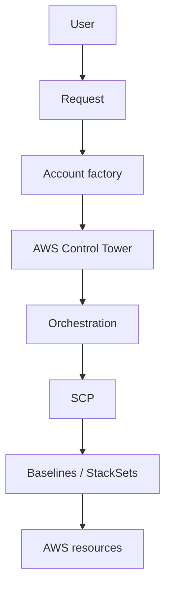
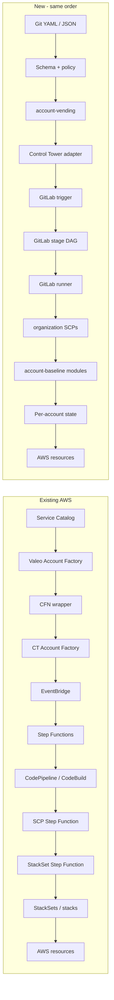
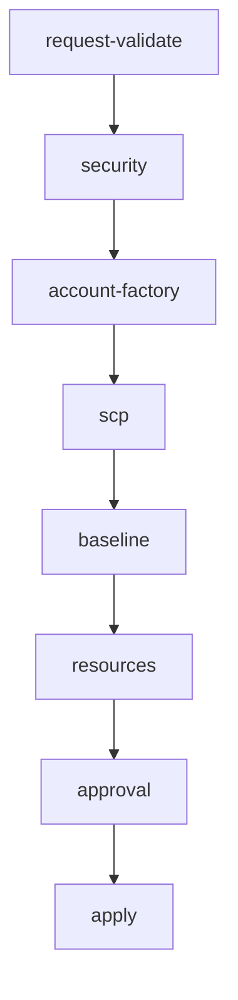
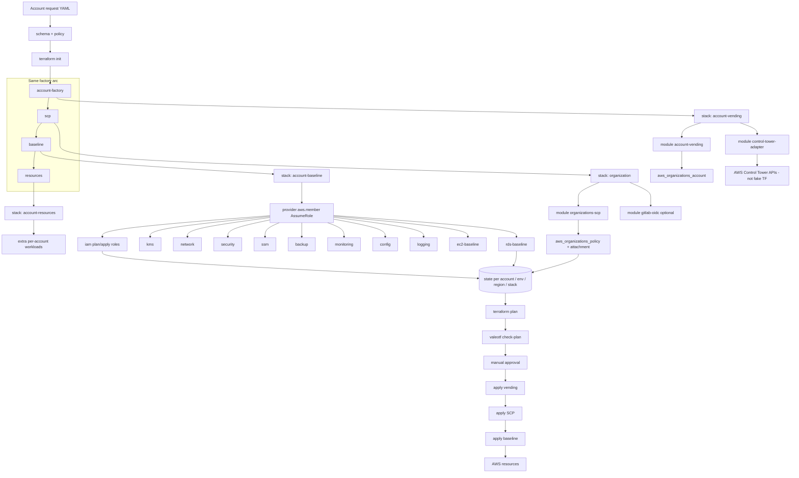
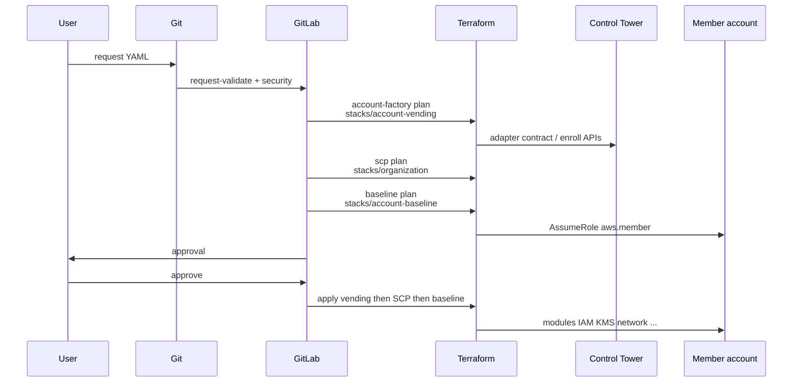

# Account provisioning

New accounts and existing-account adoption share one cloud-neutral request schema: `schemas/account-request.schema.yaml`.

## Architecture (same flow as AWS factory)

One ordered arc. AWS today uses Service Catalog + Step Functions + StackSets. This repo uses Git + GitLab + Terraform. **Control Tower stays AWS.**







## Terraform flow mapped to the arc

GitLab stages stay the factory order. Each Terraform stack is the engine for one arc step. Apply order is the same: vending → SCP → baseline.





| Order | Existing AWS | This repo |
| --- | --- | --- |
| 1 | User | User |
| 2 | Service Catalog | Git YAML + schema/policy |
| 3 | Valeo Account Factory + CFN wrapper | `terraform/stacks/account-vending` |
| 4 | Control Tower Account Factory | AWS Control Tower + adapter |
| 5 | EventBridge | GitLab pipeline trigger |
| 6 | Step Functions | GitLab DAG + Terraform graph |
| 7 | CodePipeline / CodeBuild | GitLab CI / runner |
| 8 | SCP Step Function | `terraform/stacks/organization` |
| 9 | StackSet Step Function + StackSets | `terraform/stacks/account-baseline` |
| 10 | Stacks | Per-account state + modules |

## Verification against Valeo production diagram (v1.0 Sep 2026)

Source: *Valeo AWS Control Tower – Complete Account Provisioning and Configuration Flow*.

**Verdict:** Same factory arc (request → CT account → configure → SCP + baselines → ready). Engines change. Step 7 in AWS is **parallel** SCP + StackSets; this repo applies **SCP then baseline** (safer, not identical concurrency).

| Valeo step | Production (diagram) | This repo | Match |
| --- | --- | --- | --- |
| **1 Request** | Service Catalog *Valeo Account Factory v4* (name, email, OU) | Git YAML + schema/policy | Same job, different intake |
| **2 CT Account Factory** | Create/enroll, LZ guardrails, CT baseline | AWS Control Tower **kept** + adapter (no fake TF enroll) | Same AWS control plane |
| **3 CFN wrapper** | `TriggerCoreAccountFactory` + SSM AccountMetadata | `stacks/account-vending` + Git request (no SSM replica yet) | Same job; metadata store differs |
| **4 EventBridge** | `CreateManagedAccount` SUCCEEDED | GitLab on merge of `requests/**` | Same trigger role |
| **5 Config Step Function** | 10 tasks, wait/retry up to 100 | GitLab DAG + Terraform graph | Same role; not 1:1 with all 10 tasks |
| **6 CICT CodePipeline** | Source → Build → SCP → StackSet | GitLab `scp` then `baseline` | Same stages, not CodePipeline |
| **7 Parallel config** | SCP path **and** StackSet path together | Apply SCP **then** baseline | Responsibilities yes; **not parallel** |
| **8 StackSets** | ~86 StackSets → member stack instances | Consolidated `account-baseline` modules | Same baselines, not 86 modules |
| **Ready** | CT + SCPs + StackSets + Valeo governance | Same checklist after proven apply | Target yes; not live-proven |

### Step 5 internals vs Terraform

| SFN task | Covered? | Where |
| --- | --- | --- |
| Enable Hong Kong region | No | Not in this platform |
| Wait/check status retry 100 | Partial | GitLab/Terraform, not a 100-loop waiter |
| Copy account metadata | Partial | Git YAML, not SSM AccountMetadata |
| Trigger CICT | Yes | Next GitLab stages |
| Set alternate contacts | No | Not implemented |
| Assign global roles | Yes | `modules/iam` |
| Share network resources | No | RAM/share not in network module |
| KMS + EBS encryption | Yes | `kms`, `security` |
| SNS topics | Yes | `monitoring` |
| Password policy | Yes | `security` |

### Step 8 member stacks vs modules

EC2 / RDS / Backup / SSM / Monitoring & Logging / Config → matching Terraform modules. Other → `network`, `security`, `kms`, `iam`, `account-resources`.

CloudTrail, CloudWatch, Config, SNS in the poster footer map to `logging`, `monitoring`, `config`.

Do not recreate `ct_account_configurations_step_functions`, `CustomControlTowerServiceControlPolicyMachine`, or `CustomControlTowerStackSetStateMachine`. Keep the **order of work** from the poster.

Do not use AWS-specific request fields such as `AWSAccountName`. Use `account.name`, `cloud.provider`, `cloud.region`, `account.requested_ou`.

## New account

```text
User → YAML/JSON → Git → schema + policy → terraform plan → approval
  → terraform apply → Control Tower → member account
  → cross-account role → modules → AWS resources
```

Control Tower enrollment that has no Terraform resource is requested through the adapter (`enroll_if_unenrolled`). The adapter does not fake enrollment.

## Adopt existing

Set:

```yaml
account:
  existing_account_id: "123456789012"
migration:
  mode: adopt-existing
  batch_id: batch-001
  dry_run: true
```

This does not recreate the account. It generates variables and import candidates only.

## Pipeline separation

VALIDATION → PLAN → APPROVAL → APPLY

Production apply is a GitLab `when: manual` job.
