# Architecture

Status: **same factory arc as production, Terraform implementation IN DEVELOPMENT until the first VALIDATED batch**. Legacy AWS orchestration remains the live path until Terraform owns a batch.

## Same arc as the existing factory

The new platform keeps the **same ordered flow** as Valeo production. Only the engines change.

| Order | Existing (today) | New (this repo) |
| --- | --- | --- |
| 1 | User | User |
| 2 | Service Catalog | Git YAML/JSON + schema/policy |
| 3 | Valeo Account Factory + CFN wrapper | `terraform/stacks/account-vending` |
| 4 | Control Tower Account Factory | AWS Control Tower + adapter (no fake TF resources) |
| 5 | EventBridge | GitLab pipeline trigger |
| 6 | Step Functions | GitLab stage DAG + Terraform graph |
| 7 | CodePipeline / CodeBuild | GitLab CI / runner |
| 8 | SCP Step Function | `terraform/stacks/organization` |
| 9 | StackSet Step Function + StackSets | `terraform/stacks/account-baseline` + consolidated modules |
| 10 | Stack instances / stacks | Per-account state + Terraform resources |

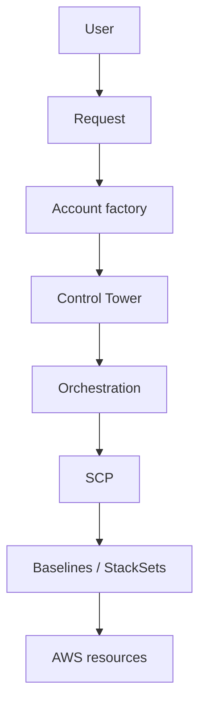

That diagram is valid for **both** systems. Existing uses Service Catalog + Step Functions + StackSets. New uses Git + GitLab + Terraform. See `pipeline/arc.yaml`.

Terraform is the IaC/orchestration layer. AWS Control Tower is the AWS-native governance boundary. Terraform does not replace Control Tower.

## 1. Current architecture

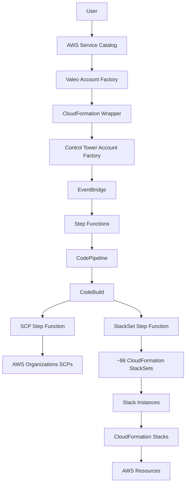

## 2. Target architecture

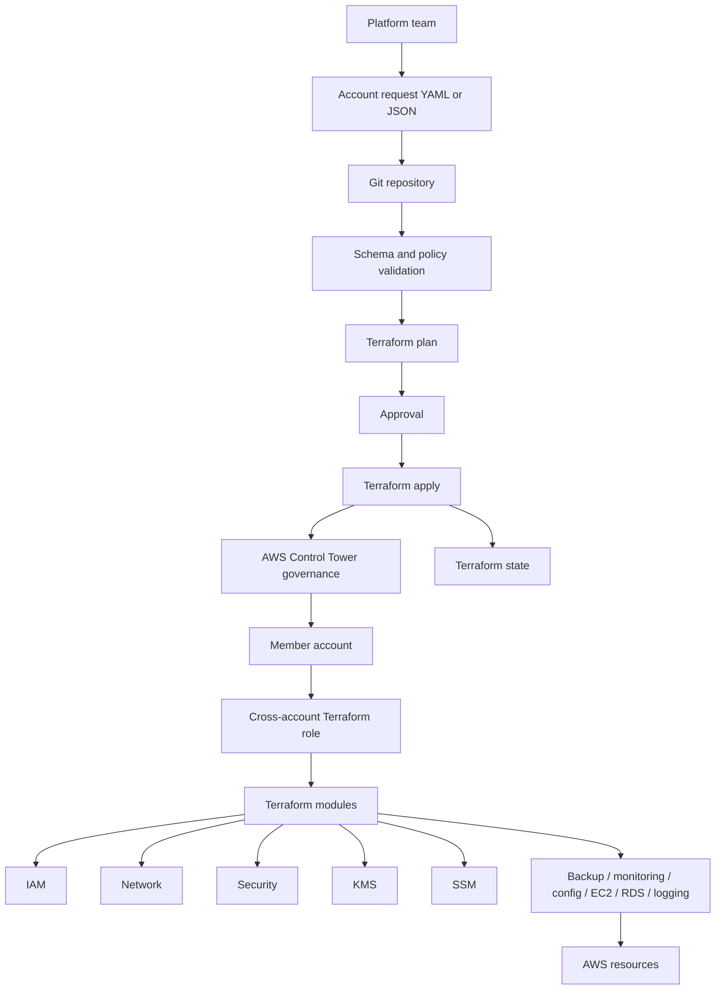

## 3. Existing 579-account migration

Inventory, Control Tower enrollment, and Terraform import are three different processes.

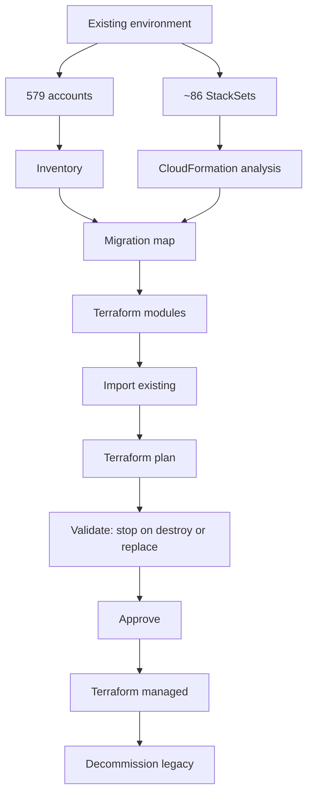

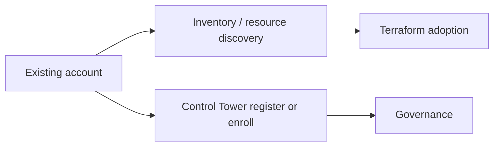

Do not import inventory into Control Tower.

## 4. CloudFormation to Terraform migration

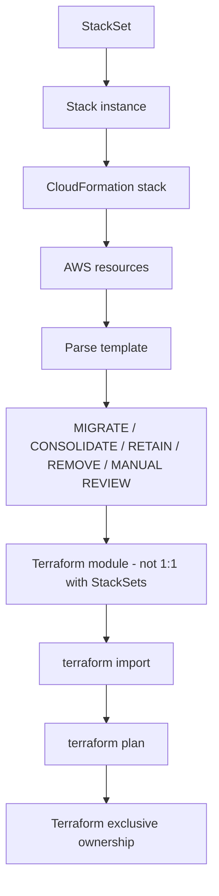

## 5. New account provisioning

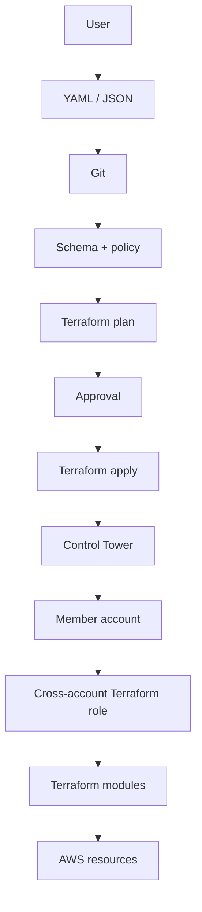

## 6. Cross-account Terraform execution

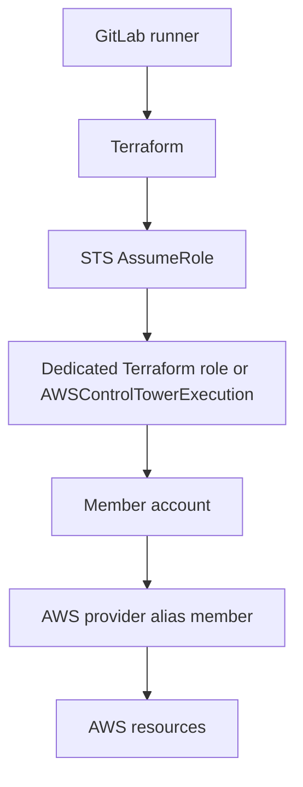

Execution stays centralized. Credentials are never hardcoded.

## 7. Terraform state architecture

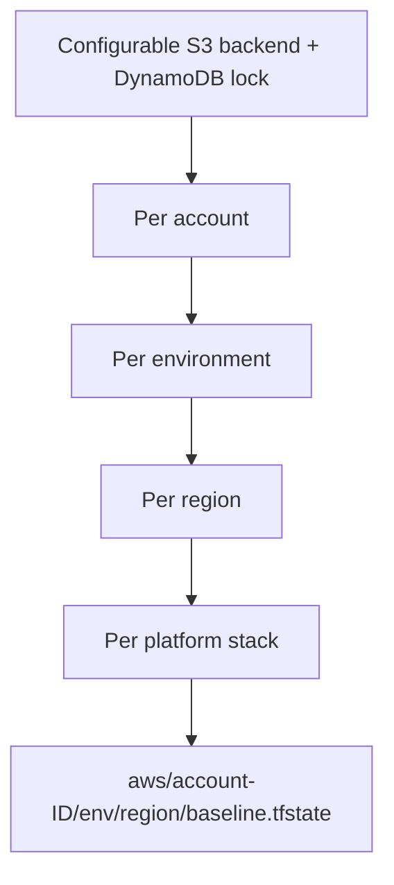

See [TERRAFORM-STATE.md](TERRAFORM-STATE.md). One state file for 579 accounts is rejected.

## 8. CI/CD flow

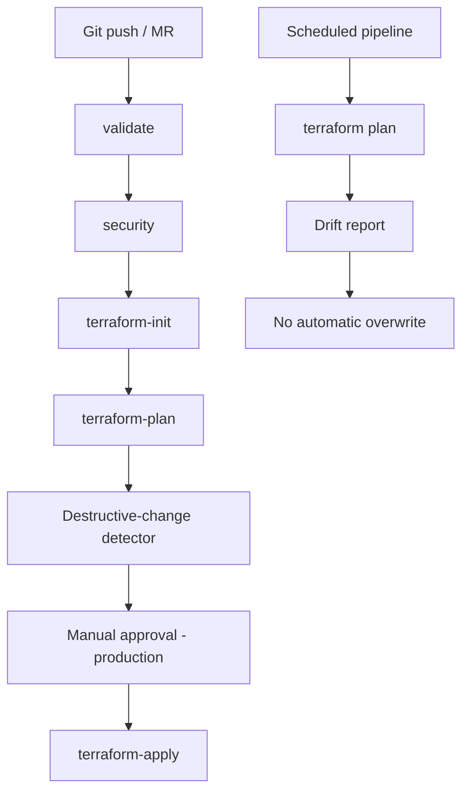

## 9. Control Tower boundary

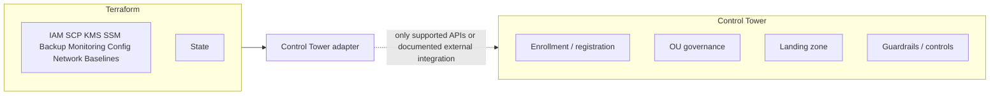

Unsupported Control Tower APIs are **not** implemented as fake Terraform resources. The adapter documents the limitation and lists approved external options.

## 10. Final end-to-end architecture

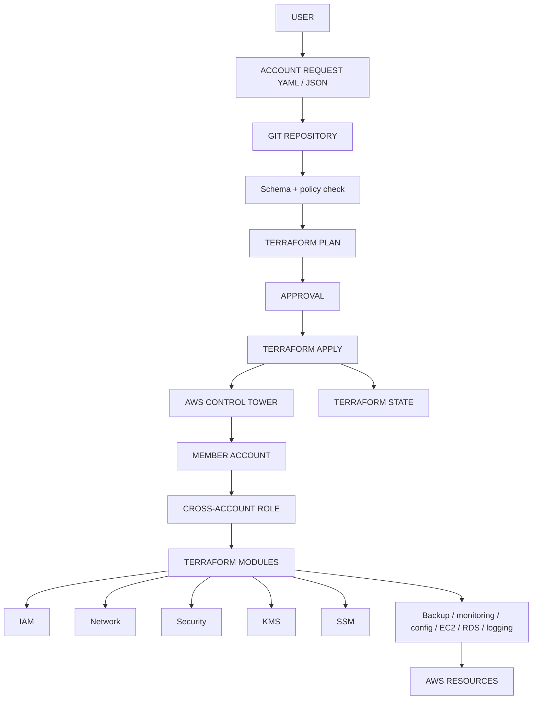

## Mapping of legacy orchestration

| Legacy | Replacement |
| --- | --- |
| Service Catalog custom workflow | Git account request |
| CloudFormation wrapper | Terraform account configuration |
| EventBridge | GitLab pipeline trigger |
| Step Functions | Terraform dependency graph |
| CodePipeline | GitLab CI/CD |
| CodeBuild | GitLab runner |
| SCP Step Function | `aws_organizations_policy` |
| StackSet Step Function | Terraform modules |
| CloudFormation StackSets | Consolidated Terraform modules |
| CloudFormation stacks | Terraform-managed resources |

## Responsibilities

| Layer | Owns |
| --- | --- |
| Control Tower | Account governance, enrollment, OUs, landing zone, CT controls |
| Terraform | Platform resources with provider support, SCPs, baselines, state |
| GitLab | Validation, plan, approval, apply, drift plan jobs |
| Inventory CLI | What exists |
| Terraform state | What Terraform manages |

## Status of this codebase

| Area | Status |
| --- | --- |
| Request schema, policy, CI skeleton | IN DEVELOPMENT |
| Terraform modules | IN DEVELOPMENT (skeletons; dry_run disables apply) |
| Inventory | Fixtures + optional live Organizations list |
| StackSet analysis | Sample catalog, not 86 live StackSets |
| Import / cutover | PROPOSED workflow only |
| Decommission of Service Catalog / Step Functions | Not started |
