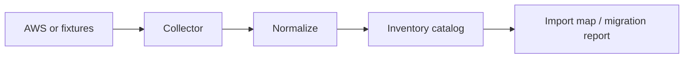

# Inventory

Inventory is a catalog of reality. It is **not** Terraform state and **not** Control Tower enrollment.

## Collect

```bash
valeotf inventory accounts
valeotf inventory resources
```

Default: JSON fixtures under `inventory/fixtures/`. Live AWS Organizations listing requires `pip install -e ".[aws]"` and `valeotf inventory accounts --live` (read-only). Resource-level live collectors are not enabled until credentials and allow-lists are agreed.

## Model

See `src/valeotf/inventory/__init__.py`. Minimum account fields: id, name, OU, region, environment, tags, Control Tower status, enabled regions. Resource groups include IAM, VPC, subnet, route tables, security groups, KMS, EC2, RDS, SSM, Backup, CloudWatch, Config, SNS, EventBridge, and related types.

## Normalization

Collectors write raw JSON; `normalize_account()` fills missing resource keys so reports stay stable.


